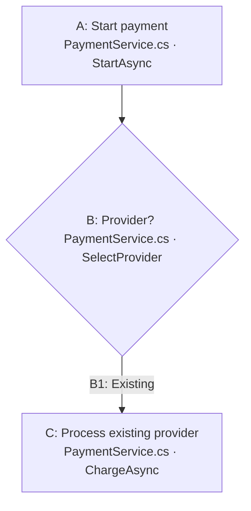

# Interactive browser chart contract

Use the bundled generator to create a standalone interactive browser page from the editable `.mmd` file:

```text
python <skill-directory>/scripts/build_preview.py <absolute-flow.mmd> <absolute-writable-preview.html> [--project-root <absolute-repo-root>]
```

Open the generated page in the Codex browser panel through a supported URL, and link the editable `.mmd` in the chat response. Keep the `.mmd` file beside the user's work or in the project documentation. Rebuild the browser page after every `.mmd` edit. Do not hand-write a second copy of the diagram in HTML. If the user explicitly asks for inline rendering, pass `--inline` to emit a fragment and use the conversation's inline visualization surface.

## Mermaid source format

Use ordinary Mermaid flowchart syntax. Give each node a stable Mermaid ID equal to its visible step ID. Include a blue source line in the label:



For a proposed change, add `class A edited` to an existing node being changed or `class D added` to a new node. The preview supplies theme-aware yellow and green fills for those classes.

Add one JSON comment for every node when creating a new chart. Code paths may be absolute or relative to the repository root. Existing targets require verified line numbers; proposed targets use `"planned": true` and omit the line. Multiple code targets are allowed.

```text
%% @node {"id":"A","code":[{"path":"src/PaymentService.cs","line":42,"method":"StartAsync"}]}
%% @node {"id":"B","code":[{"path":"src/PaymentService.cs","line":61,"method":"SelectProvider"}]}
%% @annotation {"id":"B","text":"Ask whether PayPal should be the default."}
```

These comments are part of the one `.mmd` source. Keep the annotation as one JSON comment per step ID, replacing or removing it when the user changes a note. Never key annotations by Mermaid's generated SVG IDs. Keep the source line in the node label and the metadata map in agreement.

Existing charts may instead use comments such as `%% A: C:/repo/PaymentService.cs:42 (StartAsync), :61 (SelectProvider)` and `<small>PaymentService.cs · StartAsync</small>` inside node labels. The generator reads that format too. Preserve those comments and stable IDs when revising an existing chart; conversion to `%% @node` is optional.

## Interaction and persistence

The browser chart highlights a hovered node and its outgoing connections, shows the full source path and line on the blue reference, and opens a nearby editor on right-click. **Save annotation** keeps a local draft. **Submit annotations to chat** gathers all pending drafts with their step IDs and code targets, then uses the Codex chat bridge when available. If the bridge is absent, show the complete feedback text, copy it when clipboard access works, and tell the user to paste it into chat. Never report that the fallback sent a chat message. When feedback arrives in chat, update the matching `%% @annotation` comments and regenerate the page. Only the updated `.mmd` is durable across tasks and devices.

Clicking a blue reference asks Codex to open the cited file and line. If the host cannot dispatch that action, include a working Markdown file link to the cited location in the accompanying answer. The preview must never show an unexplained `Open file` control.

## Verification

Inspect the browser chart and check at least one node of each relevant kind. Confirm that the blue source label and path tooltip appear, node and outgoing edges glow on hover, right-click opens the matching step's editor, a saved draft survives a refresh, and the submit button sends all pending notes to this chat or displays the honest copy-and-paste fallback. Check the source link too. If any behavior fails, repair the browser chart before presenting it or report the specific limit.
