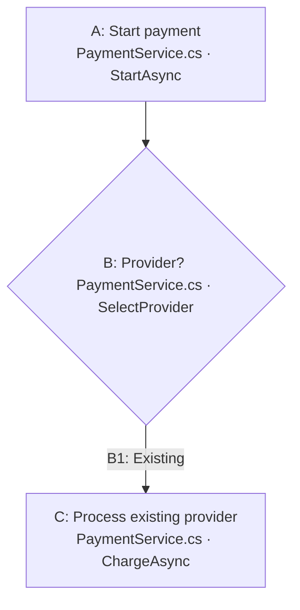

# Interactive preview contract

Use the bundled generator when the user expects file references, annotations, or hover effects. It creates a visualization fragment from the editable `.mmd` file:

```text
python <skill-directory>/scripts/build_preview.py <absolute-flow.mmd> <absolute-writable-preview.html> [--project-root <absolute-repo-root>]
```

Use the generated HTML as an inline visualization in the conversation. In Codex, include `visualize{"path":"<absolute-preview.html>"}` in the final response, followed by a link to the editable `.mmd` file. The HTML file is an implementation artifact for the inline view, not a separate page to open or send to the user. Do not create or open a browser tab for the chart unless the user explicitly asks for a separate page. Keep the `.mmd` file beside the user's work or in the project documentation; save the HTML in the task's writable visualization directory. Render again after every `.mmd` edit. Do not hand-write a second copy of the diagram in HTML.

## Mermaid source format

Use ordinary Mermaid flowchart syntax. Give each node a stable Mermaid ID equal to its visible step ID. Include a blue source line in the label:



For a proposed change, add `class A edited` to an existing node being changed or `class D added` to a new node. The preview supplies theme-aware yellow and green fills for those classes.

Add one JSON comment for every node. Code paths may be absolute or relative to the repository root. Existing targets require verified line numbers; proposed targets use `"planned": true` and omit the line. Multiple code targets are allowed.

```text
%% @node {"id":"A","code":[{"path":"src/PaymentService.cs","line":42,"method":"StartAsync"}]}
%% @node {"id":"B","code":[{"path":"src/PaymentService.cs","line":61,"method":"SelectProvider"}]}
%% @annotation {"id":"B","text":"Ask whether PayPal should be the default."}
```

These comments are part of the one `.mmd` source. Keep the annotation as one JSON comment per step ID, replacing or removing it when the user changes a note. Never key annotations by Mermaid's generated SVG IDs. Keep the source line in the node label and the metadata map in agreement.

## Interaction and persistence

The preview highlights a hovered node and its outgoing connections, shows the full source path and line on the blue reference, and opens a nearby editor on right-click. Saving an annotation must dispatch feedback to Codex to update the `%% @annotation` comment in the `.mmd` source; apply that update and regenerate the preview. Widget state and browser storage retain the note while that update is pending. Only the updated `.mmd` is durable across new tasks and devices. If feedback dispatch is unavailable, keep the editor open and report that persistence is blocked.

Clicking a blue reference asks Codex to open the cited file and line. If the host cannot dispatch that action, include a working Markdown file link to the cited location in the accompanying answer. The preview must never show an unexplained `Open file` control.

## Verification

Inspect the inline preview and check at least one node of each relevant kind. Confirm that the blue source label and path tooltip appear, node and outgoing edges glow on hover, right-click opens the matching step's editor, saving dispatches feedback and the note survives a refresh, and the source link opens or clearly requests the correct file. If any of these fail, repair the inline preview before presenting it. If the host cannot support the behavior, report the blocker rather than treating a static Mermaid block or separate page as completion.
